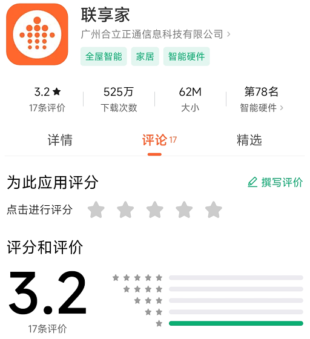
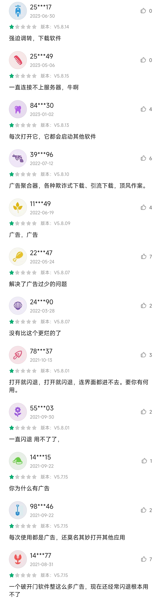

# openlxj
本项目可以被用于构建联享家app的代替品

联享家app是联享家旗下智能门禁系统的客户端app，主要被用作通过手机开启小区门禁

[http://www.lxjapp.com/](http://www.lxjapp.com/)

大家可以看看这个软件在应用商店里获得了100% 1星评价。

这是部分评论

软件里包罗万象什么都有，臃肿不堪。为了开一个门需要看数个广告，真是忍不了了。

因为软件的保护机制，暂时没有弄明白怎么获取小区所有门禁的列表，只能通过抓包获取每道门的命令地址，所以只是半成品。有兴趣的人可以自己修改参数后构建成手机app
